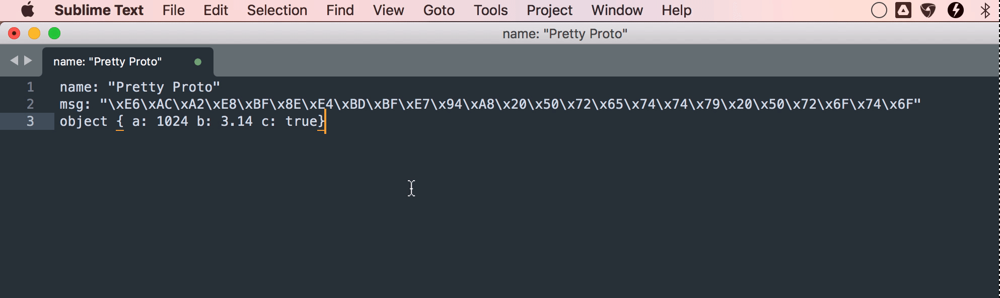

# Pretty Proto
Prettify message's ShortDebugString of Protobuf plugin for Sublime Text 3 &amp; 4

Parse message via [Python Lex-Yacc](https://github.com/dabeaz/ply)

## Installation

Install "Pretty Proto" via [Package Control](https://packagecontrol.io/)

## Usage

To prettify proto, select message's ShortDebugString and run command *pretty_proto* through Command Palette <kbd>Command+Shift+P</kbd> (macOS).

To map a key combination like <kbd>Command+Alt+J</kbd> to the Minify command, you can add a setting like this to your .sublime-keymap file (eg: `Packages/User/Default (OSX).sublime-keymap`):

```json
[
    {
        "keys": [
            "super+shift+j"
        ],
        "command": "pretty_proto"
    }
]
```



